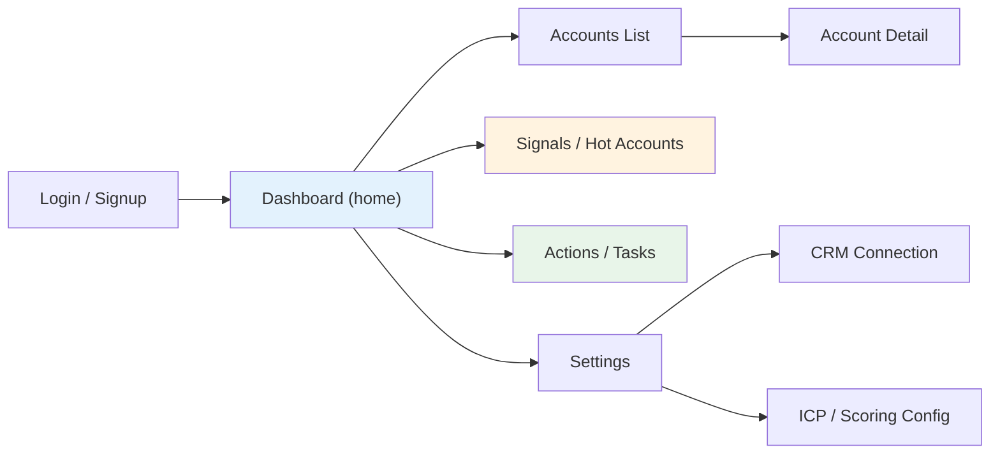
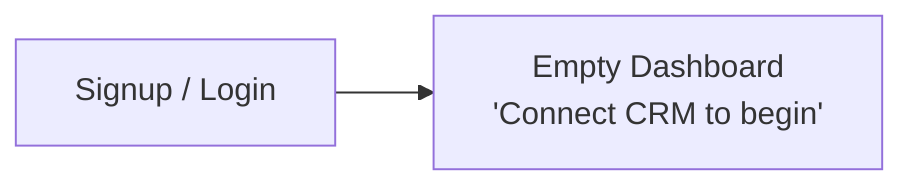
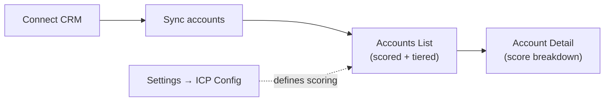
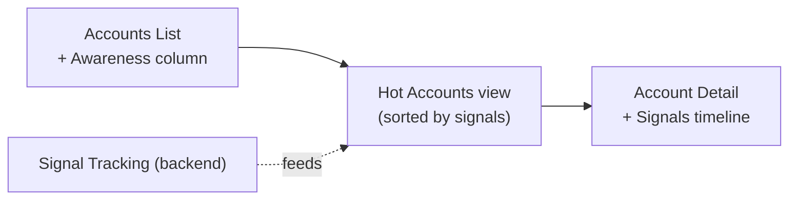
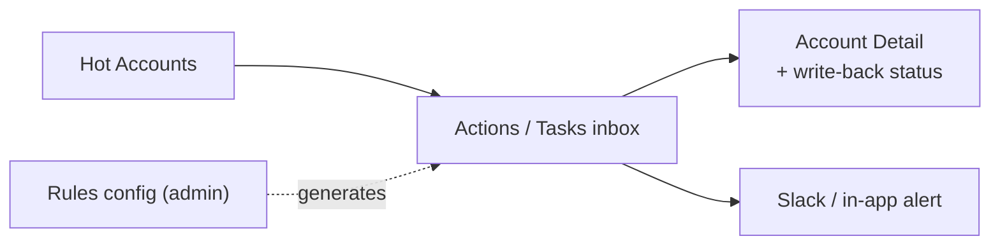
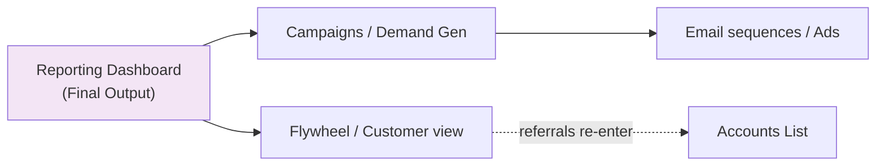
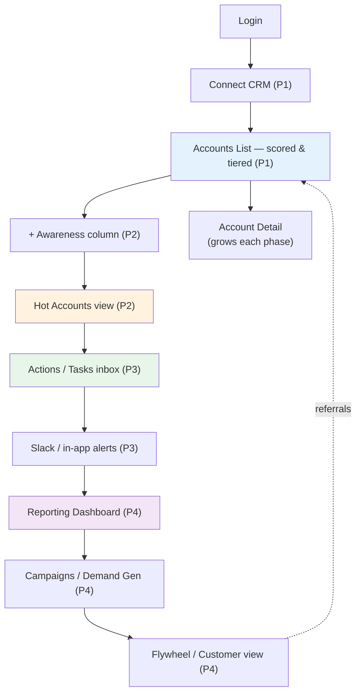

# 🖥️ ABM Engine — End-User UI Flow (Phase 0 → 4)

> [!info] How to read this
> This maps what the **end user (the customer's sales/marketing team)** actually sees and clicks, phase by phase. Each phase's UI only shows features that exist in that phase's backend — the UI grows *with* the engine, never ahead of it.
>
> **Core UI principle:** the user should never see "ABM theory." They see *accounts, scores, and what to do next.* The 15-stage workflow runs in the background; the UI surfaces only decisions and actions.

---

## 🎯 The user's mental model (what they care about)

The end user does NOT think in your 5 components. They think:

1. *"Connect my CRM."*
2. *"Show me which accounts are worth my time."* (scores/tiers)
3. *"Tell me which ones are hot right now."* (signals/awareness)
4. *"Tell me what to do, and do the boring parts for me."* (activation)
5. *"Show me it's working."* (reporting)

The UI is organized around these 5 wants — which happen to line up with your 5 phases.

---

## 🗺️ Top-level navigation (final shape, built up over phases)

> Not all of these exist from day one. Below, each phase adds screens to this map.

---

## 🟦 PHASE 0 — Scaffold (almost no real UI)

**What the user sees:** essentially nothing functional yet — this phase is plumbing.

**Screens that exist:**
- A login/signup screen (Supabase Auth)
- An empty dashboard shell with the nav skeleton
- A "Connect your CRM" placeholder (not wired yet)

> [!note] Purpose
> Phase 0 UI just proves auth + routing + the app shell work. No data. Internal/dev only — don't show customers.

---

## 🟦 PHASE 1 — Core Engine (the first *real* UI)

**User want:** *"Connect my CRM and show me which accounts are worth my time."*

This is the first version a customer can actually use. Three screens carry it.

### Screen 1 — CRM Connection (onboarding)
- User clicks "Connect HubSpot" → OAuth → returns connected.
- A sync status indicator: "Importing accounts… 240 of 1,200."
- **No raw API talk** — just "Connecting…" → "Connected ✓".

### Screen 2 — Accounts List (the workhorse screen)
A sortable, filterable table — the heart of Phase 1.

| Account | Fit Score | Tier | Industry | Size |
|---------|-----------|------|----------|------|
| Acme Corp | 82 | ⭐ Tier 1 | Fintech | 51–200 |
| Beta LLC | 41 | Tier 2 | Retail | 11–50 |

- Sort by score, filter by tier.
- Color-coded tiers (T1 green, T2 amber, T3 grey).
- This is where the user *feels the value*: "the tool already sorted my 1,200 accounts."

### Screen 3 — Account Detail
Click an account → see why it scored what it did.
- The score + tier, big and clear.
- **Score breakdown:** "Industry match +30, uses HubSpot +20, size band +15." (Transparency = trust. Never show a bare number.)
- Basic firmographic/technographic data pulled from CRM + enrichment.

### Settings — ICP / Scoring Config (admin)
- Where an admin sets the ICP rubric: fields + weights (or later, picks the model).
- Phase 1 = manual weights (per ADR-009).

> [!success] Phase 1 done (UI)
> User connects HubSpot, sees their accounts scored and tiered, and can click into any account to see *why* it scored that way.

---

## 🟧 PHASE 2 — Signals + Awareness (the UI gets a pulse)

**User want:** *"Tell me which ones are hot right now."*

Phase 1 was static (fit). Phase 2 adds **time-sensitivity** — the UI now shows movement.

### New element — Awareness stage on every account
The Accounts List gains a column:

| Account | Fit Score | Tier | Awareness |
|---------|-----------|------|-----------|
| Acme Corp | 82 | T1 | 🔴 Considering |
| Beta LLC | 41 | T2 | 🔵 Identified |

- The 5-stage funnel shown as a colored pill: Identified → Aware → Interested → Considering → Selecting.

### New screen — "Hot Accounts" / Signals view
A dedicated view that answers *"who should I look at today?"*
- Accounts sorted by **awareness + recent signal activity**, not just fit.
- "Acme visited your pricing page 3× this week" — the actual signals listed.
- This is the screen a salesperson opens every morning.

### Account Detail gains a Signals timeline
- A chronological feed: "Jun 3 — opened email · Jun 5 — visited pricing · Jun 6 — downloaded guide."
- Shows the awareness stage *and why* it's at that stage.

> [!warning] Validation-gate reminder (ADR-011)
> Before building Phase 3's automation UI, the team must confirm the awareness stage actually predicts wins. The UI for this is an *internal* admin chart (awareness stage vs close rate) — not customer-facing.

> [!success] Phase 2 done (UI)
> User opens a "Hot Accounts" view each morning and sees which accounts are warming up, with the signals that prove it.

---

## 🟩 PHASE 3 — Activation (the UI starts *doing* things)

**User want:** *"Tell me what to do, and do the boring parts for me."*

Until now the UI was *informational*. Phase 3 makes it *actionable* — it triggers things.

### New screen — Actions / Tasks inbox
A to-do list the engine generates automatically.
- "Acme hit *Considering* — call them today." [Mark done] [Snooze]
- "New Tier-1 account detected: Delta Inc." [Review]
- These are created by the Orchestrator rules, surfaced as a human task list.

### New element — Alerts (in-app + Slack)
- In-app notification bell.
- Slack message preview: the user configures "ping #sales when a T1 hits Considering."

### New screen — Rules / Automation config (admin)
- A simple rule builder: *"IF tier = 1 AND awareness = Considering THEN create task + Slack alert."*
- Start with a few preset rules; don't build a complex visual workflow editor yet.

### Account Detail gains write-back visibility
- "✓ Synced to HubSpot — fields updated: Fit Score, Awareness, Tier."
- The contact roles (Influencer / Decision Maker / Champion) shown and editable.

> [!success] Phase 3 done (UI)
> A warm account automatically creates a task and a Slack alert; the user works a generated to-do list instead of hunting through tables.

---

## 🟪 PHASE 4 — Scale Signals & GTM (the full picture)

**User want:** *"Show me it's working, and run my outreach."*

Phase 4 adds breadth: more signal sources, outreach, ads, reporting, and the flywheel view.

### New screen — Reporting / Dashboard (the "Final Output")
The executive view tying it all together:
- Accounts mapped, pipeline by tier, awareness distribution.
- Win-rate trend (is the engine actually improving outcomes?).
- The 6 "Final Output" deliverables as cards: Accounts Mapped · Campaigns/Tasks · Stakeholder Maps · Signals · Awareness Scores · Prioritization.

### New element — Campaigns / Demand-Gen view
- 1:1 track (Tier 1): personal tasks, gifting, intros.
- 1:Many track (Tier 2/3): trigger an email sequence (via Smartlead/Instantly), see status.
- Launch/monitor ABM ads (LinkedIn/HubSpot) per segment.

### New element — Flywheel / Customer view
- Won customers tracked through Onboarding → Adoption → Expansion.
- Referrals surfaced as new top-of-funnel accounts.

### Expanded signals + 2nd CRM
- 2nd/3rd-party signals appear in the timeline (job changes, funding, intent).
- A Salesforce option appears in CRM Connection alongside HubSpot.

> [!success] Phase 4 done (UI)
> The user has a full loop: a dashboard proving ROI, outreach they can launch, and a flywheel view showing won customers generating new pipeline.

---

## 🔄 The complete UI journey (all phases combined)

---

## 🧭 UI design principles (apply across all phases)

> [!tip] Rules that keep the UI usable as it grows
> 1. **Lead with the action, not the data.** The user wants "call Acme today," not a 40-column table. Surface decisions.
> 2. **Always explain the score.** Never show a bare "82" — show *why*. Trust is the product.
> 3. **One primary screen per phase.** P1 = Accounts List. P2 = Hot Accounts. P3 = Tasks inbox. P4 = Dashboard. Don't overwhelm.
> 4. **The UI never shows ABM jargon.** No "1st-party signal scorer" — just "Acme visited your pricing page."
> 5. **Build UI against mocked data first** (the parallel-work trick) — frontend doesn't wait for the engine, only for the agreed data shape.
> 6. **Admin vs user split.** ICP config, rules, validation charts = admin screens. Accounts, signals, tasks = daily-user screens.
> 7. **Don't build the dashboard before the engine works** (ADR-011) — a pretty dashboard on an unvalidated score is a demo, not a product.

---

## 🛠️ Build implication (frontend stack reminder)

- **Next.js (App Router) + TypeScript + Tailwind + shadcn/ui** for screens.
- **Tremor** for the Phase 4 dashboard charts.
- **TanStack Query** to fetch/cache account + signal data.
- Frontend person (parallel track) builds P1 screens against **mocked data matching the agreed schema** — so UI progresses while the engine is built behind it.

> [!summary] The whole UI flow in one line
> **The UI grows one primary screen per phase — Connect CRM → Accounts List (P1) → Hot Accounts (P2) → Tasks inbox (P3) → ROI Dashboard + Campaigns + Flywheel (P4) — always surfacing *what to do next*, always explaining *why*, and never exposing the ABM machinery underneath.**
